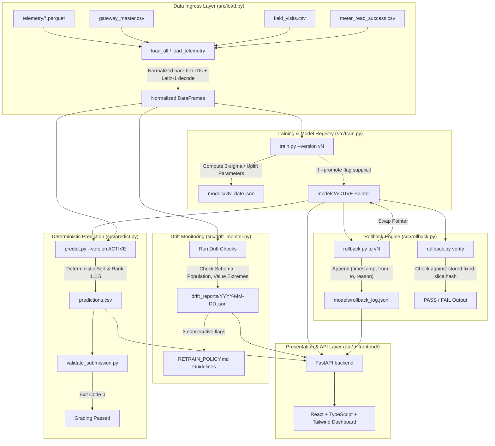

# System Architecture — LPDG Gateway Prioritization
**MLOps Track · LPDG Selection Challenge 2026**

---

## High-Level Pipeline Architecture

---

## Component Layout & Responsibilities

| Component | Path | Key Responsibility |
|---|---|---|
| Ingress Boundary | `src/load.py` | Id normalization (`06:5B:...` $\to$ `065B...`), Latin-1 decoding, schema invariant enforcement. |
| Model Training | `src/train.py` | Computes parameter artifacts, fixed-slice verification hashes, training data SHA-256 signatures. |
| Model Registry | `models/` | Plain-text `ACTIVE` pointer, versioned metadata `.json`, append-only audit trail `rollback_log.jsonl`. |
| Predictor | `src/predict.py` | Pure deterministic inference, formatted 120-row CSV generation compliant with `validate_submission.py`. |
| Drift Monitor | `src/drift_monitor.py` | Non-blocking schema, gateway population, and distribution anomaly reporting. |
| Rollback Engine | `src/rollback.py` | CLI and programmatic version swaps with cryptographic verification. |
| REST API | `api/` | High-performance FastAPI routers for registry, prediction delivery, drift status, and pipeline control. |
| Web Dashboard | `frontend/` | Interactive operations UI for telemetry drill-down, live rollback demo, and metric visualization. |
