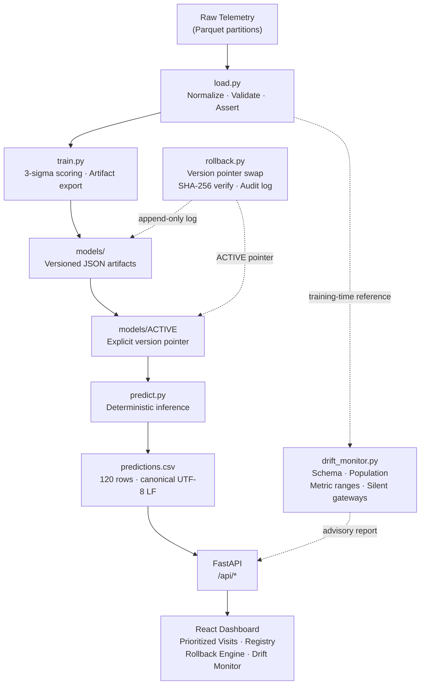

# LPDG Gateway Prioritization
### Deterministic MLOps Platform for Network Reliability Operations

**LPDG Innovation Hub Selection Challenge 2026 — MLOps Track**

An offline-first MLOps platform that operationalizes a deterministic 3-sigma gateway prioritization baseline with versioned model artifacts, reproducible inference, drift monitoring, cryptographic verification, rollback, an append-only audit trail, and an operations dashboard.

---

## Quick Start

Run with one command after cloning. No configuration required.

```bash
git clone https://github.com/Dinesh-kumar9/LPDG_project.git
cd LPDG_project

docker compose up
```

After the container starts, open **http://localhost:8000** for the operations dashboard.

**What happens when the container starts:**

1. If no active model exists, trains and promotes v1 from `./data`
2. Runs the drift monitor against current telemetry — report saved to `./drift_reports/`
3. Generates `predictions.csv` (120 rows · 8 weeks · 15 gateways/week)
4. Starts FastAPI on port 8000
5. Container health check: `GET /health`

**Verify it worked:**

```bash
# Health check
curl http://localhost:8000/health
# → {"status": "ok", "version": "1.0.0"}

# Confirm 120 prediction rows
curl -s http://localhost:8000/api/predictions | python -m json.tool | grep total_rows
# → "total_rows": 120

# Confirm active model version
curl -s http://localhost:8000/api/registry | python -m json.tool | grep active_version

# Validate submission contract (from repository root)
python backend/validate_submission.py predictions.csv
# → [PASS] predictions.csv is valid (120 rows, 8 weeks x 15 visits, ranks 1-15 per week)
```

**Interactive API documentation:** http://localhost:8000/docs

---

## Architecture



**Architecture in brief:**

- `load.py` is the **single normalization boundary** — all consumers receive the same validated, ID-normalized DataFrame
- `train.py` computes scoring parameters and exports an **immutable, content-hashed artifact** to `models/`
- `models/ACTIVE` is the **explicit version pointer** — prediction never retrains; it reads from the declared artifact
- `predict.py` produces **byte-identical output** for the same version + data, always
- `drift_monitor.py` compares incoming telemetry against **training-time reference statistics** stored in the artifact
- `rollback.py` swaps the ACTIVE pointer atomically and appends an **immutable audit entry** before changing state

---

## Why This Is MLOps, Not Just ML

This submission does not attempt to beat the 3-sigma baseline with a more complex model. It operationalizes the baseline correctly.

| MLOps Property | Implementation |
|---|---|
| Training and inference are decoupled | `src/train.py` and `src/predict.py` are independent steps |
| Model versions are immutable | Each `models/vN_*.json` artifact is written once, never overwritten |
| Deployment is an explicit act | Requires `--promote` flag or dashboard action; bad training runs cannot silently become active |
| Inference never retrains | `predict.py` reads a frozen artifact; no compute surprise during serving |
| Training data is fingerprinted | SHA-256 of the canonical telemetry DataFrame stored as `training_data_hash` |
| Predictions are fingerprinted | SHA-256 of a fixed historical prediction slice stored as `fixed_slice_prediction_hash` |
| Rollback is a real operation | ACTIVE pointer swap + prediction regeneration + SHA-256 re-verification |
| Rollback has an audit trail | Every version change appended to `models/rollback_log.jsonl` — never truncated |
| Drift is monitored | Schema, gateway population, metric ranges, and silent gateways checked per run |
| Retraining has a written policy | See [RETRAIN_POLICY.md](RETRAIN_POLICY.md) — 3 consecutive drift flags or ground-truth accumulation |
| Docker provides reproducible execution | Single `docker compose up` from cold start |
| Contract tests guard the API | 58 automated tests across 9 test modules |

> **Strategic decision (ADR 0008):** The MLOps track allocates 60% of the evaluation score to operational infrastructure. A deterministic, auditable, rollback-tested pipeline using the baseline earns more evaluative signal than a slightly better model in a notebook. See [DECISIONS.md](DECISIONS.md) for the full rationale.

---

## How the Pipeline Works

### 1. Load
`src/load.py` reads all Parquet telemetry partitions, normalizes gateway IDs to bare uppercase hex (`06:5B:92` → `065B92…`), and asserts minimum cross-table ID overlap. This is the **only place** where raw data enters the pipeline. All downstream components receive the normalized output.

### 2. Normalize
Latin-1 encoding is applied explicitly when reading `gateway_master.csv`, which contains German geographic metadata. Colon-MAC addresses in asset registers are stripped to match bare-hex telemetry IDs. Failures at this boundary are loud, not silent.

### 3. Validate
A schema assertion confirms that required columns and minimum gateway overlap exist. A data quality failure here aborts the pipeline before it can produce unreliable rankings.

### 4. Train and Version
`src/train.py` computes per-gateway 3-sigma baselines from the 28-day window and exports a JSON artifact containing all parameters needed to reproduce the rankings exactly, including SHA-256 fingerprints of both the training data and a fixed verification slice.

### 5. Promote
Promotion to the ACTIVE version is an explicit step (`--promote` flag). A training run that has not been promoted has no effect on inference. This prevents a bad training run from silently becoming the live model.

### 6. Predict
`src/predict.py` reads the currently ACTIVE artifact and produces a deterministic `predictions.csv`. Given the same artifact and the same data, the output is byte-identical on every run and every platform.

### 7. Monitor Drift
The drift monitor compares each week's incoming telemetry against training-time reference statistics stored in the active artifact. It produces an advisory report; it does not trigger retraining.

### 8. Serve
FastAPI reads `predictions.csv` and the model registry from disk, enriching predictions with gateway metadata from `gateway_master.csv`. The React dashboard renders the operations view.

### 9. Roll Back
When verification fails or rankings degrade, `rollback.py` swaps ACTIVE, appends an audit entry, and regenerates predictions from the new active model — all in under a minute.

---

## The Model

The scoring model implements the challenge's supplied 3-sigma baseline without modification.

**Parameters (v1):**

| Parameter | Value |
|---|---|
| sigma (σ) | 3.0 |
| Baseline window | 28 days |
| Recent window | 7 days |
| Metrics scored | `offline_duration_sec`, `disconnection_cnt`, `reboot_cnt` |
| Visits per week | 15 |
| Min baseline hours | 24 (gateways below this are excluded from ranking) |

**Score interpretation:**
> Score = number of recent hours in the 7-day window whose metric value exceeds the gateway's own per-metric 3σ threshold (µ + σ × 3), summed across all three metrics.

A higher score means more anomalous recent behavior relative to that gateway's own historical baseline. The top-15 gateways by score are ranked for field visits each week.

**Gateways excluded from ranking:**
- Fewer than 24 hours of baseline history → excluded with a logged warning (insufficient statistics)
- Zero rows in the recent 7-day window → score 0, falls below rank 15 naturally; surfaced via drift report's `silent_gateways` field

**Intentional design:**
> The baseline model was retained because this submission targets the MLOps track. Engineering effort was directed at operational reliability, reproducibility, and auditability — not at improving baseline predictive accuracy.

---

## Model Registry

```
backend/models/
├── v1_2026-08-31.json                    ← Good model (σ=3.0)
├── v2_broken_2026-09-03_2026-09-03.json  ← Broken demo model (σ=999)
├── ACTIVE                                 ← Points to current version ID
└── rollback_log.jsonl                     ← Append-only audit trail
```

**Model artifact contents (`vN_*.json`):**

```json
{
  "version_id": "v1_2026-08-31",
  "model_type": "rule_based_3sigma",
  "trained_at": "2026-08-31T...",
  "parameters": { "sigma": 3.0, "baseline_days": 28, "recent_days": 7, "..." : "..." },
  "training_data_hash": "sha256:c51ff05d...",
  "fixed_slice_prediction_hash": "sha256:92f7f415...",
  "known_gateway_ids": ["..."],
  "known_gateway_count": 320,
  "drift_reference": { "metric_maxima": {}, "schema_columns": [] }
}
```

**ACTIVE pointer:** A plain text file containing a single version ID. `cat models/ACTIVE` is sufficient to determine the deployed model. No service, no database.

**Rollback log:** Each version change appends one JSON line:
```json
{"timestamp": "2026-09-03T04:15:55Z", "from_version": "v1_2026-08-31", "to_version": "v2_broken_...", "reason": "..."}
```
The log is never truncated or modified.

---

## Deterministic Inference and SHA-256 Verification

Byte-identical prediction output across platforms required solving three distinct non-determinism sources:

### Canonical Serialization Pipeline

```
Raw telemetry (Parquet partitions, OS-dependent enumeration order)
  → load_telemetry()      — normalize, validate
  → drop_duplicates()     — remove 13,094 confirmed duplicate rows
  → sort_values(all 5 columns)  — unique sort key after dedup
  → to_csv(lineterminator="\n") — LF enforced (not os.linesep)
  → .encode("utf-8")
  → SHA-256
  → training_data_hash
```

```
Fixed historical prediction slice (week_start = 2025-11-03, hardcoded constant)
  → score_all_weeks()
  → sort_values([week_start, score DESC, gateway_id])
  → to_csv(float_format="%.1f", lineterminator="\n")
  → .encode("utf-8")
  → SHA-256
  → fixed_slice_prediction_hash
```

**Three non-determinism sources fixed:**

| Bug | Cause | Fix |
|---|---|---|
| Sort instability | `sort_values(['gateway_id','ts'])` on non-unique key with 13,094 dup rows | `drop_duplicates()` first, then `sort_values(all 5 cols)` |
| Cross-platform hash mismatch | `pandas.to_csv()` uses `os.linesep` (CRLF on Windows, LF on Linux/Docker) | `lineterminator="\n"` pinned in both serializers |
| Prediction format inconsistency | Mixed `str(df.to_csv(...))` vs `df.to_csv(...)` paths | Single `_serialize_predictions_canonical()` function used throughout |

**What SHA-256 proves:**
> SHA-256 proves **byte-level reproducibility** of the canonical representation — not model quality. If rollback verification passes, the model version is producing output that is bitwise identical to its training-time prediction.

**Rollback verification:**
```bash
python -m src.rollback verify --data ./data
# Verifying model version: v1_2026-08-31
# Fixed slice date: 2025-11-03
# Expected hash: sha256:92f7f415...
# Computed hash: sha256:92f7f415...
# [OK] PASS — v1_2026-08-31 produces byte-identical output to training time.
```

---

## Drift Monitoring

The drift monitor runs at container startup and on demand via `POST /api/drift/run`.

**What is checked:**

| Check | Description |
|---|---|
| Schema invariants | Required columns present and correctly typed |
| Gateway population | Incoming gateway IDs compared against training-time known set |
| Metric range checks | Incoming values compared against **training-time** metric maxima stored in artifact |
| Silent gateway detection | Gateways with zero telemetry rows in the last 7 days are surfaced explicitly |

**Advisory model:**
> Drift is advisory, not an automatic retraining trigger. A single flagged week may reflect a transient sensor fault or a data pipeline hiccup, not a structural change in gateway behavior. The retrain policy requires **3 consecutive flagged weeks** before recommending retraining.

**Drift vs. rollback vs. model configuration:**

| Question | Answered by |
|---|---|
| Has incoming data changed from training distribution? | Drift monitor (`drift_flagged`) |
| Does this model version reproduce its expected output? | Rollback verify (SHA-256 comparison) |
| Are the model parameters sensible for this use case? | Artifact inspection (`sigma`, gateway count) |

**Retraining policy:** See [RETRAIN_POLICY.md](RETRAIN_POLICY.md) for trigger conditions, operator validation procedure, and the €380/€600 economic framework.

---

## Rollback

Rollback is not a UI label change. It changes the ACTIVE model pointer and re-runs deterministic inference from the new version's stored parameters.

### Demonstrated Rollback Lifecycle

```
V1 (σ=3.0) ACTIVE → predictions meaningful, verify PASS
  ↓
Promote V2 (σ=999) — intentionally broken for regression demo
  ↓
V2 produces all-zero scores — threshold unreachable, rankings meaningless
  ↓
Verify V2 → FAIL — hash mismatch detected (expected for this demo artifact)
  ↓
Rollback: ACTIVE ← V1
Audit entry appended to rollback_log.jsonl
  ↓
predictions.csv regenerated from V1 parameters
  ↓
Verify V1 → PASS — sha256:92f7f415... matches exactly
  ↓
Dashboard refreshes — V1 predictions visible, ACTIVE header updated
```

**About the broken V2 model:**
- `sigma = 999` makes the 3σ threshold `µ + 999σ` — effectively unreachable for all gateways
- All gateway scores are 0; rankings are meaningless
- Verification fails because the output hash differs from a σ=3.0 model's hash
- This artifact is deliberately committed to demonstrate verifiable broken-model detection

**CLI rollback:**
```bash
python -m src.rollback to v1_2026-08-31 --reason "V2 regression confirmed — all scores zero"
python -m src.rollback verify --data ./data
```

---

## API Reference

All endpoints served from `http://localhost:8000`. Interactive documentation: `/docs`.

| Method | Endpoint | Description |
|---|---|---|
| `GET` | `/health` | Liveness — `{"status": "ok", "version": "..."}` |
| `GET` | `/api/predictions` | Predictions (optional `?week_start=YYYY-MM-DD` filter) |
| `POST` | `/api/predictions/run` | Regenerate `predictions.csv` from current ACTIVE model |
| `GET` | `/api/predictions/download` | Download `predictions.csv` directly |
| `GET` | `/api/registry` | Active version and all registered versions |
| `GET` | `/api/registry/versions/{version_id}` | Single artifact with stored hashes |
| `GET` | `/api/drift/status` | Latest drift report, consecutive flagged weeks, retrain flag |
| `GET` | `/api/drift/history` | All historical drift reports |
| `POST` | `/api/drift/run` | Run drift check against current telemetry |
| `GET` | `/api/rollback/log` | Full append-only rollback audit trail |
| `POST` | `/api/rollback/execute` | Execute version swap `{"to_version": "...", "reason": "..."}` |
| `POST` | `/api/rollback/verify` | Verify active model SHA-256 (optional `?version_id=...`) |
| `POST` | `/api/pipeline/train` | **HTTP 501 by design** — training is CLI-only |

---

## Operations Dashboard

The React dashboard at `http://localhost:8000` is an operations layer. It does not perform scoring computations.

**Prioritized Visits** — weekly field-visit candidates ranked by anomaly score, enriched with site type, region, hardware model, and meter count from the gateway asset register.

**Model Registry** — all versioned model artifacts with training date, active status, and stored training-data hash.

**Rollback Engine** — version selector, audit-reason input, one-click rollback execution, hash verification with contextual messaging: intentional failures shown in amber, genuine failures in red, PASS in green. Append-only audit trail visible inline.

**Drift Monitor** — latest drift report with schema, population, range, and silent-gateway status. Consecutive flagged weeks counter. On-demand drift check trigger.

---

## Testing and Quality

```bash
cd backend
pytest                                    # 58 tests, coverage report
ruff check . && ruff format --check .    # lint + format
mypy src/ api/                           # strict type checking
bandit -r src/ api/                      # security scan
```

**58 tests across 9 test modules:**

| Module | Tests | What is verified |
|---|---|---|
| `test_train.py` | 15 | Artifact schema, hash determinism, CRLF/LF invariant, rollback round-trip |
| `test_drift_monitor.py` | 11 | Schema/population/range drift, silent gateways, historical anchor |
| `test_scoring.py` | 6 | 3-sigma flagging, threshold edge cases, score accumulation |
| `test_consecutive_drift.py` | 9 | Streak counting, reset on clean week, corrupted report handling |
| `test_load.py` | 8 | ID normalization, Latin-1 encoding, cross-table join validation |
| `test_api.py` | 5 | FastAPI routes, predictions enrichment, rollback API |
| `test_rollback.py` | 2 | Full lifecycle, invalid version rejection |
| `test_determinism.py` | 1 | Byte-identical output across two predict runs |
| `test_portable_pipeline.py` | 1 | Train → predict → validate full in-memory pipeline |

**Notable regression tests:**
- `test_training_data_hash_uses_lf_not_crlf` — asserts `lineterminator="\n"` is used; fails if `os.linesep` leaks in on Windows
- `test_canonical_hash_detects_row_order_difference` — asserts different row order produces different hash
- `test_drift_monitor_reports_historical_range_breach` — injects a value 1000× above training maximum to confirm the range check is not tautological

---

## Submission Output Contract

| Requirement | Value |
|---|---|
| File | `predictions.csv` |
| Total rows | 120 |
| Weeks | 8 |
| Gateways per week | 15 |
| Columns | `week_start`, `rank`, `gateway_id`, `score`, `reason` |
| Rank values | 1–15 per week |
| Score format | Float, 1 decimal place (`%.1f`) |

Validate the generated file from the repository root:

```bash
python backend/validate_submission.py predictions.csv
```

---

## Docker Details

```yaml
# Container startup sequence (from docker-compose.yml)
if [ ! -f models/ACTIVE ]; then
  python -m src.train --data /app/data --promote
fi
python -m src.drift_monitor --data /app/data --reports-dir /app/drift_reports
python -m src.predict --data /app/data --out /app/backend/predictions.csv
uvicorn api.main:app --host 0.0.0.0 --port 8000
```

| Host path | Container path | Purpose |
|---|---|---|
| `./data` | `/app/data` (read-only) | Telemetry, asset registers |
| `./backend/models` | `/app/backend/models` | Model artifacts, ACTIVE pointer, audit log |
| `./drift_reports` | `/app/drift_reports` | Drift report JSON files |

Health check: `curl -f http://localhost:8000/health` every 15 s, 3 retries.

Training via HTTP returns HTTP 501 by design. Training is CLI-only to prevent accidental model promotion during a live session.

---

## Engineering Decisions

Key decisions; full ADRs in [DECISIONS.md](DECISIONS.md):

| Decision | Rationale |
|---|---|
| Retain 3-sigma baseline | MLOps track scores infrastructure, not model accuracy |
| File-based model registry | Zero external dependencies; inspectable with `cat`; offline-safe |
| Single normalization boundary in `load.py` | Prevents silent zero-row join bugs from colon vs bare-hex ID mismatch |
| Explicit Latin-1 encoding | Preserves German characters in asset metadata; fails loudly if wrong |
| Advisory drift monitoring | Prevents auto-retraining on transient sensor noise |
| Atomic ACTIVE updates via temp-file replace | Prevents partial writes from corrupting the version pointer |
| Audit log written before ACTIVE changes | Log is consistent even if the write crashes mid-way |
| `POST /api/pipeline/train` returns 501 | HTTP-triggered training during a live session is an operational risk |
| Exclude gateways with <24 h baseline | Insufficient history produces unreliable std; exclusion is explicit and logged |
| Silent gateways in drift report, not ranking | Total silence is operationally ambiguous; human review required before dispatch |

---

## Known Limitations

1. **No intra-week streaming inference.** Weekly Monday batch cadence. A gateway failing on Wednesday appears in rankings the following Monday.
2. **No autonomous work-order dispatch.** The API produces a prioritized list; a human dispatcher decides which visits to schedule.
3. **No root-cause repair.** Anomaly scoring identifies behavioral divergence; root-cause confirmation requires on-site diagnostic.
4. **Cold-start exclusion.** Gateways with fewer than 24 hours of baseline history are excluded from ranking for that week.
5. **Episode re-detection.** The model does not track visited gateways within a fault episode. A gateway ranked #1 two weeks running may represent the same ongoing fault.
6. **Drift monitoring is advisory.** Drift does not automatically trigger retraining or rollback; human sign-off is required.
7. **Economic validation is manual.** The €380/€600 cost framework is documented in [RETRAIN_POLICY.md](RETRAIN_POLICY.md) but not automated.

---

## What Another Two Weeks Would Fix

Ranked by estimated impact on the €600/week cost metric:

1. **Episode tracking** — down-weight gateways already visited in the trailing N weeks to avoid re-dispatching to the same ongoing fault
2. **Meter-read success weighting** — multiply anomaly score by `1 - meter_read_rate` to prioritize gateways whose failures are already measurably costly (`data/meter_read_success.csv` exists)
3. **Ground-truth feedback loop** — use `field_visits.csv` outcomes as weak labels to validate whether a supervised model beats the 3-sigma baseline on total cost
4. **Economic validation utility** — 30-line CLI script that computes net cost delta between candidate and active model on held-out weeks
5. **Silent gateway dispatcher endpoint** — `GET /api/drift/silent-gateways` returning only the advisory silent-gateway list

See [DECISIONS.md ADR 0006](DECISIONS.md) for the full roadmap.

---

## Demo Flow

**Video Demonstration:** [Watch the 7–8 minute MLOps demonstration](https://drive.google.com/file/d/1Ptray9EvWmx4MESkM-dZJtHof5KeHx9S/view?usp=drive_link)

Suggested sequence for the evaluation screen recording:

1. `docker compose up` — observe startup: training, drift check, prediction generation
2. Open `http://localhost:8000`
3. **Prioritized Visits** — select a week, inspect top-15 with scores and reasons
4. **Model Registry** — show v1 (ACTIVE), v2_broken, training-data hash
5. **Drift Monitor** — show drift report, schema status, silent gateway list
6. Promote v2_broken → observe all-zero scores in Prioritized Visits
7. **Verify Hash Match** with v2_broken active → amber: "INTENTIONAL DEMO FAILURE — sigma=999"
8. Rollback to v1_2026-08-31, provide audit reason, Execute Rollback
9. **Prioritized Visits** refreshes with meaningful V1 predictions
10. **Verify Hash Match** with v1 active → green: "PASS — SHA-256 matches"
11. **Rollback Audit Trail** — full append-only history of version changes

---

## AI Usage

AI assistance was used for code generation, test scaffolding, and documentation synthesis under engineering oversight. See [AI-USAGE.md](AI-USAGE.md) for specifics.

**Notable example of human verification catching an AI error:** The initial drift monitor range check compared incoming values against the incoming batch's own maximum — a tautological check that could never flag anything. This was caught by reading the comparison logic (not just running the tests, which were also passing for the same reason). The fix stores `metric_maxima` at training time in `drift_reference` and compares against training-time statistics. The regression test `test_drift_monitor_reports_historical_range_breach` injects a value 1000× the training maximum to guard against this class of error.

---

## Where to Look

| Reviewer wants to inspect | File |
|---|---|
| Data ingestion and ID normalization | [`backend/src/load.py`](backend/src/load.py) |
| 3-sigma scoring, artifact export, SHA-256 hashing | [`backend/src/train.py`](backend/src/train.py) |
| Deterministic prediction from versioned artifact | [`backend/src/predict.py`](backend/src/predict.py) |
| Drift monitoring logic | [`backend/src/drift_monitor.py`](backend/src/drift_monitor.py) |
| Rollback and verification | [`backend/src/rollback.py`](backend/src/rollback.py) |
| FastAPI routes | [`backend/api/routers/`](backend/api/routers/) |
| All automated tests | [`backend/tests/`](backend/tests/) |
| Model artifacts and ACTIVE pointer | [`backend/models/`](backend/models/) |
| Drift reports | [`drift_reports/`](drift_reports/) |
| Docker container configuration | [`docker-compose.yml`](docker-compose.yml) · [`backend/Dockerfile`](backend/Dockerfile) |
| Architecture decisions (ADRs) | [`DECISIONS.md`](DECISIONS.md) |
| Retraining policy | [`RETRAIN_POLICY.md`](RETRAIN_POLICY.md) |
| AI usage disclosure | [`AI-USAGE.md`](AI-USAGE.md) |

---

*LPDG Innovation Hub Selection Challenge 2026 — MLOps Track submission.*
