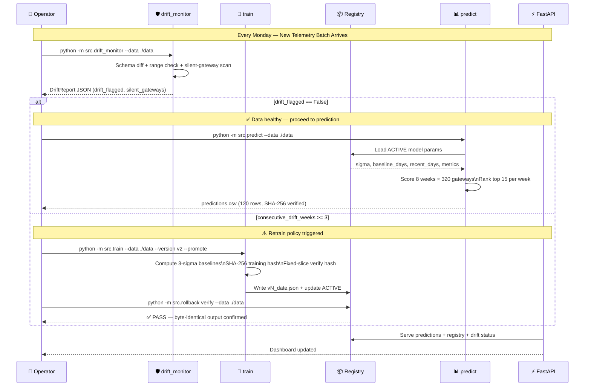
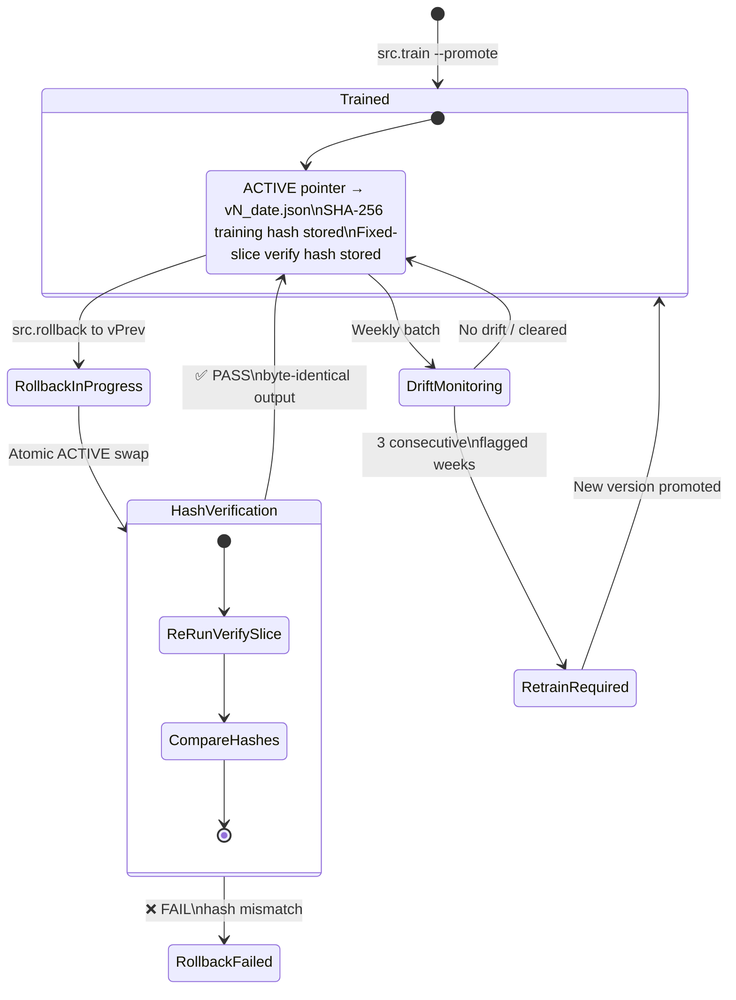

# LPDG Gateway Visit Prioritization (MLOps Track)
**LPDG Innovation Hub Selection Challenge 2026**

[](https://github.com/Dinesh-kumar9/LPDG_project/actions)
[](https://github.com/Dinesh-kumar9/LPDG_project/actions)
[-blue.svg)](https://github.com/Dinesh-kumar9/LPDG_project/actions)
[](https://www.python.org/)
[](https://fastapi.tiangolo.com/)
[](https://reactjs.org/)

---

## 📹 Demo Recording

> **Link will be added here before 23:59 IST on Wednesday 16 September.**

The 6–8 minute recording covers: `docker compose up` startup · `validate_submission.py` PASS ·
model registry (2 versions, ACTIVE pointer) · rollback with SHA-256 verification ·
drift monitor schema-flag demonstration · DECISIONS.md walkthrough.

---

## 1. Problem Statement & Economics

LPDG operates a telemetry relay network of ~320 radio gateways for utility meter collection. Gateways experience silent degradation and fail without immediate notification. Field operations are constrained by a **hard cap of 15 site visits per week**.

**Cost Structure:**
| Event | Economic Impact |
|---|---|
| Visit finds a real fault | **+€600 / week** saved until repaired |
| Visit finds nothing (false alarm) | **-€380** wasted technician dispatch |
| Broken gateway left alone | **-€600 / week** repeating loss |

Historical baseline hit rate was ~34.7% (60.7% wasted visits). This system provides an **auditable, deterministic, MLOps-governed prioritization engine** to optimize technician dispatch decisions across 8 scored weeks (2 Feb – 23 Mar 2026).

---

## 2. Architecture & MLOps Components

### 2.1 System Architecture

```mermaid
flowchart TD
    subgraph INPUT["📥 Data Ingress"]
        T["Telemetry Parquet\n(hourly, partitioned by month)"]
        M["gateway_master.csv\n(Latin-1, site metadata)"]
        F["field_visits.csv\n(historical dispatches)"]
        R["meter_read_success.csv"]
    end

    subgraph LOAD["🔄 src/load.py — Single Normalization Boundary"]
        L1["MAC → bare-hex ID normalization"]
        L2["Latin-1 German string decode"]
        L3["Schema invariant assertions"]
        L4["Timestamp UTC alignment"]
    end

    subgraph DRIFT["🛡️ src/drift_monitor.py — Pre-Inference Guard"]
        D1["Schema column diff\n(missing / new columns)"]
        D2["Gateway population check\n(>5% new IDs → flag)"]
        D3["Value range check\n(>5× training max → flag)"]
        D4["Silent gateway detection\n(0 rows in last 7 days → warn)"]
        D5["DriftReport JSON\n+ consecutive-week counter"]
    end

    subgraph TRAIN["🧠 src/train.py — Versioned Training"]
        TR1["3-sigma per-gateway\nbaseline statistics"]
        TR2["SHA-256 training data hash"]
        TR3["Fixed-slice verification hash\n(VERIFY_SLICE_DATE)"]
        TR4["Model artifact JSON\n(params + hashes + gateway IDs)"]
    end

    subgraph REGISTRY["📦 models/ Registry"]
        REG1["vN_date.json artifacts"]
        REG2["ACTIVE pointer\n(atomic file replace)"]
        REG3["rollback_log.jsonl\n(append-only audit)"]
    end

    subgraph ROLLBACK["↩️ src/rollback.py"]
        RB1["Atomic ACTIVE swap"]
        RB2["SHA-256 verify\n(byte-identical output check)"]
        RB3["Audit log append"]
    end

    subgraph PREDICT["📊 src/predict.py — Deterministic Inference"]
        P1["Load ACTIVE model params"]
        P2["Score 8 weeks × all gateways\n(3-sigma flagged-hours)"]
        P3["Rank top 15 per week"]
        P4["predictions.csv\n(120 rows, canonical byte format)"]
    end

    subgraph API["⚡ FastAPI Backend"]
        A1["GET /api/predictions"]
        A2["GET /api/registry"]
        A3["GET /api/drift/status"]
        A4["POST /api/rollback"]
        A5["GET /health"]
    end

    subgraph UI["🖥️ React Operations Dashboard"]
        U1["Predictions table\n(week selector, rank view)"]
        U2["Model registry viewer\n(versions + ACTIVE badge)"]
        U3["Drift monitor panel\n(schema / range / silent alerts)"]
        U4["Rollback controls\n(one-click + hash verification)"]
    end

    INPUT --> LOAD
    LOAD --> DRIFT
    LOAD --> TRAIN
    TRAIN --> REGISTRY
    ROLLBACK --> REGISTRY
    REGISTRY --> PREDICT
    PREDICT --> API
    DRIFT --> API
    REGISTRY --> API
    ROLLBACK --> API
    API --> UI

    style INPUT fill:#1e3a5f,color:#fff,stroke:#2563eb
    style LOAD fill:#1e3a5f,color:#fff,stroke:#2563eb
    style DRIFT fill:#3b1f2b,color:#fff,stroke:#dc2626
    style TRAIN fill:#1a3329,color:#fff,stroke:#16a34a
    style REGISTRY fill:#2d1f3a,color:#fff,stroke:#9333ea
    style ROLLBACK fill:#2d1f3a,color:#fff,stroke:#9333ea
    style PREDICT fill:#1a3329,color:#fff,stroke:#16a34a
    style API fill:#1e3a5f,color:#fff,stroke:#2563eb
    style UI fill:#1e2a3a,color:#fff,stroke:#0ea5e9
```



---

### 2.2 Weekly MLOps Pipeline — Execution Flow



---

### 2.3 Model Registry & Rollback State Machine




---

## 3. Data Prerequisites & Environment Setup

Raw telemetry and gateway metadata are **intentionally excluded from version control** for size and confidentiality reasons (`.gitignore`).

### Expected Dataset Structure
When running the pipeline or test suite with real data, supply a dataset directory structured as follows:

```
<data-dir>/
├── telemetry/
│   └── month=YYYY-MM/*.parquet           # Gateway hourly metrics
├── gateway_master.csv                    # Latin-1 master metadata & site types
├── field_visits.csv                      # Historical technician dispatches
├── meter_read_success.csv                # Downstream reception rates
└── engineer_review_2026-02.xlsx          # Qualitative investigation flags
```

### Specifying Data Location
The pipeline does not hardcode data paths in production code:
- **CLI Flags**: Pass `--data /path/to/data` to any script (`src.train`, `src.drift_monitor`, `src.predict`, `src.rollback`).
- **Environment Variable**: Set `LPDG_DATA_DIR=/path/to/data` (see [`backend/.env.example`](backend/.env.example) for all available variables and copy it to `backend/.env` for local development).

---

## 4. Quick Start

### Option A: Docker Compose (Backend API & Pipeline)
A [`backend/Dockerfile`](backend/Dockerfile) is provided. Because raw data is not checked into git, you must supply the dataset in a `./data` directory at the repository root before launching:

```bash
# 1. Place or symlink the challenge dataset into ./data
mkdir -p data
# copy telemetry, master metadata, etc. into ./data

# 2. Build and start services
docker compose up --build
```
- Dashboard UI: `http://localhost:8000`
- Interactive OpenAPI Docs: `http://localhost:8000/docs`
- Healthcheck: `http://localhost:8000/health`

### Option B: Step-by-Step CLI Execution
```bash
cd backend

# Install dependencies
pip install -r requirements.txt

# 1. Train model v1 and promote to ACTIVE
python -m src.train --data "../path/to/data" --version v1 --promote

# 2. Run pre-inference drift check
python -m src.drift_monitor --data "../path/to/data"

# 3. Generate deterministic predictions.csv (120 rows)
python -m src.predict --data "../path/to/data" --out predictions.csv

# 4. Optional external submission validation
# If the challenge validator (e.g., validate_submission.py) is available in your evaluation environment:
python /path/to/validate_submission.py predictions.csv
```

---

## 5. Live Session Rollback Demo (Under 60 Seconds)

During live evaluation, the system demonstrates instant rollback and cryptographic verification:

```bash
# 1. Inspect current active version
python -m src.rollback current
# Output: v1_2026-08-31

# 2. Train an experimental/broken candidate (e.g. sigma=999) and promote
python -m src.train --data "../path/to/data" --version v2_broken --sigma 999 --promote

# 3. Rollback immediately to v1 with operational audit reason
python -m src.rollback to v1_2026-08-31 --reason "v2 produced degenerate rankings"

# 4. Verify cryptographic hash match on fixed historical slice
python -m src.rollback verify --data "../path/to/data"
# Output: [OK] PASS -- v1_2026-08-31 produces byte-identical output to training time.
```

---

## 6. Repository Layout

```
├── backend/
│   ├── Dockerfile                # Backend container image definition
│   ├── src/
│   │   ├── load.py               # Single normalization boundary & schema validation
│   │   ├── train.py              # Versioned training & artifact creation
│   │   ├── predict.py            # Deterministic inference engine
│   │   ├── drift_monitor.py      # Pre-inference drift detection
│   │   └── rollback.py           # Registry controller & hash verification
│   ├── api/                      # FastAPI routers & dependencies
│   ├── models/                   # Model registry (JSON artifacts + ACTIVE + audit log)
│   ├── tests/                    # Pytest suite (56 test functions across 9 modules)
│   ├── predictions.csv           # Committed 120-row baseline submission
│   ├── pyproject.toml            # Ruff, Mypy, Pytest configuration
│   └── requirements.txt
├── frontend/                     # React 18 + TypeScript + Tailwind operations UI
├── drift_reports/                # Stored JSON drift monitor outputs
├── RETRAIN_POLICY.md             # Defensible operational retraining criteria
├── DECISIONS.md                  # Architectural Decision Records (ADRs)
├── ARCHITECTURE.md               # Visual system diagrams
├── AI-USAGE.md                   # Disclosure of AI tooling assistance
└── docker-compose.yml
```

---

## 7. Testing & Quality Assurance

- **56 Unit & Integration Test Functions** across 9 test suites, including a portable synthetic-data pipeline test that runs without private challenge data.
- **CI Pipeline Enforced**:
  - **Ruff**: Linting and formatting checked across all Python code (`ruff==0.8.6`).
  - **Mypy**: Strict type-checking with zero errors (`strict = true`).
  - **Bandit**: Security vulnerability static analysis (`bandit -ll`).
  - **Coverage Gate**: CI enforces a **20% coverage gate** (`--cov-fail-under=20`) to account for data-dependent integration fixtures being skipped when external raw datasets are not checked into the repository. Full test coverage runs when the raw dataset is mounted locally.
- **Auditability & Determinism**:
  - `models/ACTIVE` updated via atomic filesystem replace (`tmp.replace(ACTIVE)`).
  - Every rollback audit log appended to `models/rollback_log.jsonl`.
  - Predictions are verified deterministic: byte-identical output across separate runs on identical inputs.

## 8. Demonstration Runbook

See [DEMO_RUNBOOK.md](DEMO_RUNBOOK.md) for the exact submission validation,
drift-monitor, and rollback commands to run during the live session.

---

## 9. How to Tell It Is Working

After `docker compose up` reaches `Application startup complete`:

```bash
# Health check — should return {"status": "ok", "version": "1.0.0"}
curl http://localhost:8000/health

# Predictions — should return 120-row JSON with 8 weeks
curl http://localhost:8000/api/predictions | python -m json.tool | grep total_rows

# Model registry — should list 2 versions with one marked ACTIVE
curl http://localhost:8000/api/registry

# Drift status — should show consecutive_flagged_weeks and latest report
curl http://localhost:8000/api/drift/status
```

### What to Do When It Is Not Working

| Symptom | Likely Cause | Fix |
|---|---|---|
| `docker compose up` exits immediately | Missing `data/` directory | `mkdir -p data` and place the data bundle inside |
| `curl /health` → connection refused | Container not ready yet | Wait 30–60 s for uvicorn to start after pipeline runs |
| `/api/predictions` returns 404 | `predictions.csv` not generated | `curl -X POST http://localhost:8000/api/predictions/run` |
| `/api/registry` shows no versions | `models/ACTIVE` missing | `docker exec <container> python -m src.train --data /app/data --promote` |
| `docker compose up` fails on install | Python version mismatch | Ensure Docker is running; the image pins Python 3.12 |
| Logs show `missing required column` | New telemetry schema | Run drift monitor: `curl -X POST http://localhost:8000/api/drift/run` |

### Regenerate Predictions After New Data Arrives

```bash
# API (no container restart needed):
curl -X POST http://localhost:8000/api/predictions/run

# CLI (inside container or with local venv):
python -m src.predict --data /app/data --out /app/backend/predictions.csv
```
